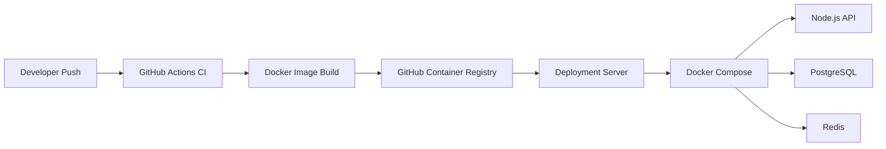

# Delivery Pipeline

## Overview

This delivery layer demonstrates a simple production-style CI/CD workflow for `devops-service-stack`.

The goal is to show that the service can be validated, packaged as a Docker image, published to GitHub Container Registry, deployed with Docker Compose, and rolled back to a previous image tag.

## Delivery Flow



## Workflows

The repository includes these workflows:

- `Service Stack CI` — validates the Node.js service and Docker build.
- `Infra Guard CI` — validates the Python CLI tool against sample logs.
- `Publish Service Stack Image` — publishes the service image to GitHub Container Registry.

## Manual Docker Publish

The Docker publish workflow supports manual execution with:

```text
Actions -> Publish Service Stack Image -> Run workflow
```

## Deploy

From a deployment server with Docker installed:

```bash
cd delivery/deploy
cp .env.prod.example .env.prod
nano .env.prod
./deploy.sh
```

## Rollback

Rollback to a previous image tag:

```bash
cd delivery/deploy
./rollback.sh ghcr.io/m-ksa0/devops-portfolio-lab/devops-service-stack:<commit-sha>
```

## Secrets and Environment Files

Production secrets are not committed. The deployment uses:

```text
delivery/deploy/.env.prod
```

This file should be created on the deployment server and ignored by Git.

## Why This Matters

This delivery layer demonstrates:

- reproducible deployments
- versioned container images
- environment separation
- safe rollback workflow
- operational deployment documentation
