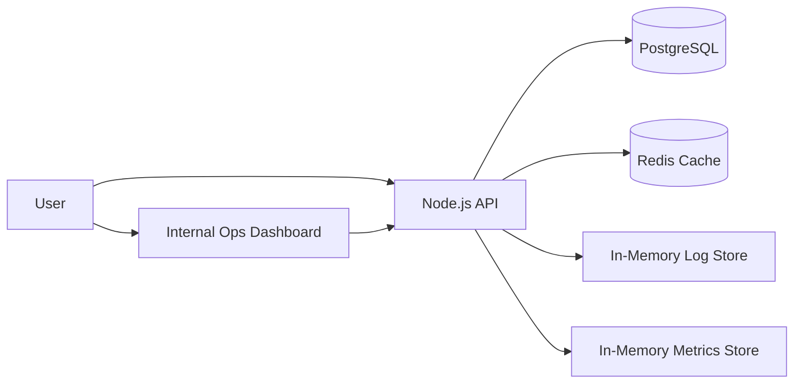

# DevOps Service Stack

A production-style backend service designed to demonstrate practical DevOps engineering: containerized deployment, PostgreSQL persistence, Redis caching, health checks, structured logs, internal observability, and a lightweight operations dashboard.

## Why this project exists

This project is not a generic CRUD API. It is a small operational backend system built to show how I design services with reliability, visibility, and maintainability in mind.

It demonstrates:

- Linux/backend operational thinking
- Dockerized service orchestration
- PostgreSQL-backed persistence
- Redis caching with cache invalidation
- Health checks for service dependencies
- Internal dashboard for testing and visibility
- In-memory request metrics and recent service logs

## DevOps Decisions

### Why Docker Compose?

Docker Compose provides a reproducible local environment with the API, PostgreSQL, and Redis running together. This makes the project easy to test, demo, and extend.

### Why Redis?

Redis is used to cache the location list endpoint. This demonstrates a common backend performance pattern: serving repeated reads from cache while invalidating the cache when data changes.

### Why an internal dashboard?

The dashboard acts as an operations console, not a product frontend. It exposes service health, dependency status, recent logs, request metrics, and API testing tools.

### Why in-memory metrics?

For this portfolio version, in-memory metrics keep the system simple while still demonstrating observability thinking. In production, this would be replaced or extended with Prometheus/Grafana.

## Resume Highlights

- Built a containerized backend service with Node.js, PostgreSQL, Redis, and Docker Compose.
- Implemented service health checks, dependency monitoring, structured logging, and internal operational visibility.
- Added Redis caching with cache invalidation to demonstrate backend performance optimization.
- Designed an internal dashboard for API testing, service status, request metrics, and recent system logs.

## Architecture

